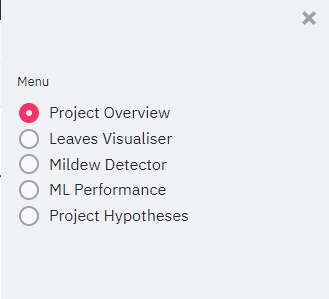

# Powdery Mildew Detector Cherry

## Overview

The Powdery Mildew Detector Cherry is a machine learning project which is designed to detect powdery mildew in the leaves of cherry trees to assist Farmy & Foods (a fictional agricultural company) in managing powdery mildew in their crops to reduce time in quality control, maintain product standards and maximise profit. 

Please use the link below to view the live, deployed site:

[Powdery Mildew Detector - Live App](https://powdery-mildew-detector-cherry-edbe0ab1b346.herokuapp.com/)

## CONTENTS

- [Mildew Detector](#Mildew-Detector)
  - [Overview](#overview)
  - [CONTENTS](#contents)
  - [User Experience Design](#user-experience-design)
    - [The Strategy Plane](#the-strategy-plane)
      - [Site Goals](#site-goals)
      - [Agile Planning](#agile-planning)
        - [Epics](#epics)
        - [User Stories](#user-stories)
    - [The Scope Plane](#the-scope-plane)
    - [The Structure Plane](#the-structure-plane)
      - [Features](#features)
      - [General Features On All pages](#general-features-on-all-pages)
    - [The Skeleton Plane](#the-skeleton-plane)
      - [Wireframes](#wireframes)
      - [Security](#security)
  - [Future Implementations/Plans](#future-implementationsplans)
    - [Accessibility](#accessibility)
  - [Technologies Used](#technologies-used)
    - [Languages Used](#languages-used)
    - [Libraries and External Sources](#libraries-and-external-sources)
  - [Deployment](#deployment)
  - [Local Development](#local-development)
    - [How to fork](#how-to-fork)
    - [How to clone](#how-to-clone)
  - [Testing](#testing)
  - [Credits](#credits)
    - [Code Used](#code-used)
  - [Acknowledgements](#acknowledgements)

## Business Requirements

The cherry plantation crop from Farmy & Foods is facing a challenge where their cherry plantations have been presenting powdery mildew. Currently, the process is manual verification if a given cherry tree contains powdery mildew. An employee spends around 30 minutes in each tree, taking a few samples of tree leaves and verifying visually if the leaf tree is healthy or has powdery mildew. If there is powdery mildew, the employee applies a specific compound to kill the fungus. The time spent applying this compound is 1 minute. The company has thousands of cherry trees, located on multiple farms across the country. As a result, this manual process is not scalable due to the time spent in the manual process inspection.

To save time in this process, the IT team suggested an ML system that detects instantly, using a leaf tree image, if it is healthy or has powdery mildew. A similar manual process is in place for other crops for detecting pests, and if this initiative is successful, there is a realistic chance to replicate this project for all other crops. The dataset is a collection of cherry leaf images provided by Farmy & Foods, taken from their crops.

From this, the business requirements are:

- 1 - Farmy & Foods are interested in conducting a study to visually differentiate a healthy cherry leaf from one with powdery mildew.

- 2 - Farmy & Foods are interested in predicting if a cherry leaf is healthy or contains powdery mildew.

## Business Case Assessment

2. Is there any business requirement that can be answered with conventional data analysis?
Yes, we can use conventional data analysis to conduct a study to visually differentiate a cherry leaf that is healthy from one that contains powdery mildew.

3. Does the client need a dashboard or an API endpoint?
The client needs a dashboard.

4. What does the client consider as a successful project outcome?
A study showing how to visually differentiate a cherry leaf that is healthy from one that contains powdery mildew.
Also, the capability to predict if a cherry leaf is healthy or contains powdery mildew.

5. Can you break down the project into Epics and User Stories?
Information gathering and data collection.
Data visualization, cleaning, and preparation.
Model training, optimization and validation.
Dashboard planning, designing, and development.
Dashboard deployment and release.

6. Ethical or Privacy concerns?
The client provided the data under an NDA (non-disclosure agreement), therefore the data should only be shared with professionals that are officially involved in the project.

7. Does the data suggest a particular model?
The data suggests a binary classifier, indicating whether a particular cherry leaf is healthy or contains powdery mildew.

8. What are the model's inputs and intended outputs?
The input is a cherry leaf image and the output is a prediction of whether the cherry leaf is healthy or contains powdery mildew.

9. What are the criteria for the performance goal of the predictions?
We agreed with the client a degree of 97% accuracy.

10. How will the client benefit?
The client will not supply the market with a product of compromised quality. The client will gain a much faster, more scalable mechanism, to detect powdery mildew and perform quality control across multiple farms and sites.

## Project Hypotheses and Validation

1 - There will be a significant visual difference between healthy and powdery mildew infected leaves which facilitates differentiation between the two.

2 - Powdery mildew infected leaves will display a greater amount of white/grey on their surfaces.

3 - Healthy leaves will exhibit a largely green surface

## Rationale of Business Requirements to Data Visualisation and Machine Learning Tasks

- Business Requirement 1 - Data Visualisation

- The dashboard will showcase the 'mean' and 'standard deviation' images for both healthy and powdery mildew-infected cherry leaves.
- The dashboard will display the contrast between an average healthy leaf and an average leaf infected with powdery mildew.
- The dashboard will have the ability to provide an image montage featuring healthy and powdery mildew infected leaves to give users a snapshot of the image data used.

- Business Requirements 2 - ML Prediction/Identification

- A machine learning model will be created and fitted to the image data to develop an ML system which is able to classify with satisfactory accuracy whether or not a leaf/leaves are infected with powdery mildew or not.
- The treshold accuracy for this ML system is 97%.

## User Experience Design

As the project will primarily be used via a Streamlit dashboard a great deal of the design considerations for a traditional website do not apply. However I felt it was useful to some of the aspects relating to user experience design to show a consideration for User Experience and engagement with the dashboard as far as is possible. 

### The Strategy Plane

#### Site Goals

This application is primarily focused on providing and meeting the following key objectives, based on the business requirements:

1) A study to visually differentiate a cherry leaf that is healthy from one that contains powdery mildew.

2) An application which can predict if a cherry leaf is healthy or contains powdery mildew.

#### Agile Planning

This application was designed and built in line with Agile methodologies, with small, incremental features developed over controlled sprints. There were 6 sprints spaced out across 8 weeks. 

Each feature was assigned an epic and individually prioritised following the MoSCoW rating system, being designated Must have, Should have, Could have and Won't have. These designations were assigned based on perceived requirements of the business and the effort required to develop them. Features were developed with Must have's being completed first, and so on, to ensure that the most useful and fundamental aspects of the application and dashboard were built first, with 'bells and whistles' features being completed later depending on the time left. 

A kanban board was used to track the progress and manage the development lifecycle, the completed board can be viewed here:

https://github.com/users/TomLiDev/projects/2/views/1

#### User Stories

The below is a list of the user stories linked and required to achieve completion of each Epic, with a brief one line description of the epic itself and some of the key elements for it to be completed. Each user story was created with a specific list of tasks which act as acceptance criteria and facilitate an objective determination on whether the functionality was developed, and user story completed, to the required level. Some user stories do not have a more detailed acceptance criteria as this is not necessary, e.g. create Readme. 

#### Epics

The project had 4 Epics which encompass the main development effort for building this powdery mildew detector. Each epic includes some key elements with more detailed user stories explained below.

EPIC 1 - Information Gathering and Data Collection

- Define Business Requirements
- Create Business Case Assessment
- Identify and Collect Data for the Project
- Create Rationale of Business Requirements to Data Visualisation and ML Tasks

EPIC 2 - Project Set Up and Documentation

This epic incorporates the user stories required for the initial project setup and initial deployment. This epic and the user stories within was the first to be completed.

- Install necessary libraries and requirements
- Ensure Kaggle json files and other sensitive information kept secure
- Successfully deploy via Heroku early prior to main development effort
- Create and maintain project documentation

EPIC 3 - Data Collection, Preparation and Visualisation

This epic incorporates the work and user stories required to collect the necessary data, clean the data, analyse, visualise and split the data in preparation for use by a machine learning system.  

- Add Kaggle json and import necessary data
- Clean data, check for missing values, convert data where necessary etc
- Visualise data
- Split data into train, test and validate sets and create figures to display the data split graphically

EPIC 4 - Create and Evaluate Machine Learning System

This epic incorporates the work to create, fit and evaluate the machine learning system based on the prepared data:

- Create ML pipeline/system
- Fit ML pipeline to data 
- Evaluate the ML pipeline for predictive performance against the business objectives

EPIC 5 - Create Streamlit Dashboard

This epic includes the user stories which define the business user facing requirements, so that the ML project and key deliverables can be interacted with and users can engage and make use of the functionality offered. 

- Create project summary dashboard page
- Create Mildew Detector dashboard page
- Create Mildew Prediction dashboard page
- Create Project Hypothesis and Success dashboard page

### The Scope Plane

- Dashboard. A visually attractive and simple to use dashboard for users engage with the key deliverables desired for this project. 

### Dashboard Design

### Features

### General Features On All Dashboard pages

#### Nav Bar

On the left of every page will be the same radio button options to select and navigate to different pages. 

#### Project Title

Each page will have the same title, the project name - Powdery Mildew Detector Cherry

### Project Summary/Overview Page

The first page of the dashboard will be the project summary page. 

This will give a brief text summary of the key points of the project, the data used, the business requirements, project hypotheses and validation.

### Leaf Visualisation Page

The dashboard will contain a data visualisation page, this will summarise some of the key characteristics of the data. Specifically it will include:

- Figures showing the average and variance between healthy and powedery-mildew infected leaves.
- Figure showing the 
- The option to create an image montage, showing the user a small collection of typical images for healthy and powdery mildew infected leaves. 

### Mildew Detector 

The dashboard will include a page where users can upload images of leaves for the ML to classify whether or not the leaf(s) is infected with powdery mildew or not. This will page will.

- Include an option for users to upload a leaf image.
- Return a prediction on whether or not the leaf is infected with powdery mildew or not.

### ML Performance

This dashboard page will show and explain the performance of the machine learning system to a business user. Specifically it will include:

- Figures showing how the image data was split for training, testing and validation.
- Figures showing the evolution of the ML system through fitting
- A figure showing the overall predictive accuracy of the ML 

### Project Hypotheses and Validation Page

This page will explain how the project has delivered against the business objectives and what this means for the acceptance/rejection of the project hypotheses.

This page will list each hypothesis, whether the project has provided the means to validate the hypothesis, and subsequently whether or not the hypothesis can be accepted or rejected.

### The Skeleton Plane

As the project will largely be viewed in a Streamlit dashboard, the amount of customisation and design in the layout of the dashboard pages is limited. 

#### Wireframes

As all the pages will follow a similar Streamlit dashboard design the requirement for wireframes is limited, but the below were created to aid development:

[Homepage Wireframes](documentation/homepage-wireframe.PNG)

[Create Find Page Wireframe](documentation/create-find-wireframe.PNG)

[View Finds Page Wireframe](documentation/view-finds-wireframe.PNG)

[Find (Individual) Detail Wireframe](documentation/find-detail-wireframe.PNG)

[Error page Wireframe](documentation/error-page-wireframe.PNG)

#### Security

They key security element of this project is the protection of the developers Kaggle json. This file will be carefully managed to ensure it is not exposed or committed ot the repository.

## Future Implementations/Plans

In the future I would like to incorporate:

1. JSON/AJAX to Communicate Data - Getting Javascript and Django/Python to 'talk' to each other was an ongoing challenge during this project. This most prominent in creating the map markers (more detail below). I did explore in detail the possibility of incorporating JSON and AJAX calls to push/pull data from different parts of the system, however this isn't something I was familiar with and simply couldn't afford to spend the time to learn from scratch for functionality which wasn't crucial for the project. 
 

### Accessibility

As this project is usable/visible via a Streamlit dashboard, modern accessibility requirements are met by this method. 

- All images have alt text attributes and all links have aria labels for use by screen readers.

- The colour scheme has been chosen to ensure a good level of contrast is maintained for text across the site.

- Semantic markup has been used throughout.

- Including hover states to aid navigation.

## Technologies Used

### Languages Used

Python and Jupyter Notebooks. Markdown is used in the project documentation and within the Jupyter notebooks. 

### Third Party and External Sources

- Git - Version control.

- Github - To save and store code for the website itself.

- Code anywhere - The workspace and IDE for producing the site.

- Lucidchart - For wireframes and models.

- Google Developer Tools - For troubleshooting/bug resolution and testing responsiveness

- W3C Validators - For checking validity of HTML and CSS.

- Am I Responsive? - To create images of website on range of device screens.

- Kaggle - Project Data

### Libraries Used

- pandas
- seaborn
- numpy
- matplotlib
- plotly
- joblib
- tensorflow
- keras

## Deployment

This was website was deployed using Heroku. Instructions to do this are:

1. Go to Github and Log in (or sign up).

2. Find the repository for this project, TomLiDev/mushroom-mappers.

3. Copy, (or clone as below) the code from the repository into your IDE.

4. In your IDE, install the necessary project dependencies by running pip install -r requirements.txt

5. Go to Heroku, and log in (or sign up)

6. Navigate to the Heroku Dashboard and click "Create new app".

7. Enter a name.

8. From the "Add buildpack" option, add the Python buildpack and save

9. Add the node.js buildpack and save.

10. Select Github from the deployment method.

11. Find the repository name you have given to your version of this project, click connect. 

12. Scroll to the next section and select automatic deploys, choosing to enable automatic deploys.

13. Save and commit your code in your IDE.

14. Check your commit has gone through and the Heroku automatic deployment has been successful.

## Local Development

### How to fork

1. Log in (or sign up) to Github.

2. Go to the repository for this project, TomLiDev/mushroom-mappers.

3. Click the Fork button in the top right corner.

### How to clone

1. Log in (or sign up) to GitHub.

2. Go to the repository for this project, TomLiDev/mushroom-mappers.

3. Click on the code button, select whether you would like to clone with HTTPS, SSH or GitHub CLI and copy the link shown.

4. Open the terminal in your code editor and change the current working directory to the location you want to use for the cloned directory.

5. Type 'git clone' into the terminal and then paste the link you copied in step 3. Press enter.

## Testing

Please see separate testing.md for full details.

[Testing](TESTING.md)

## Credits

### Code and Information Used

The following sites were used for information/code:

- https://stackoverflow.com/questions/21517879/python-pil-resize-all-images-in-a-folder - Used for guidance on converting image size. 

- https://www.datacamp.com/tutorial/line-plots-in-matplotlib-with-python - Used for customising and creating line plots.

- https://stackoverflow.com/questions/20457038/how-to-round-to-2-decimals-with-python - Used for reference to rounding figures.

- https://stackoverflow.com/questions/28576203/how-to-count-the-number-of-pixels-of-a-certain-color-in-python - Used for guidance on creating a function to count number of coloured pixels.

## Acknowledgements

-  My Code Institute Mentor

- My family - For your help in testing and providing feedback.