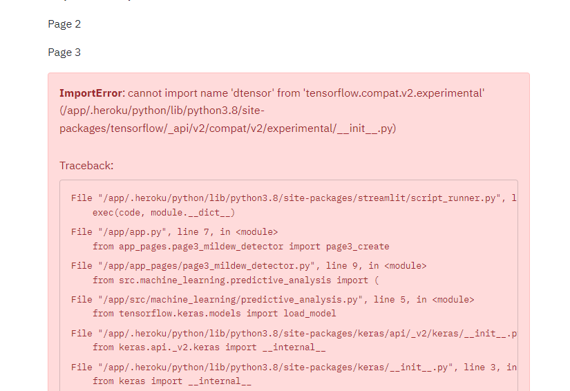
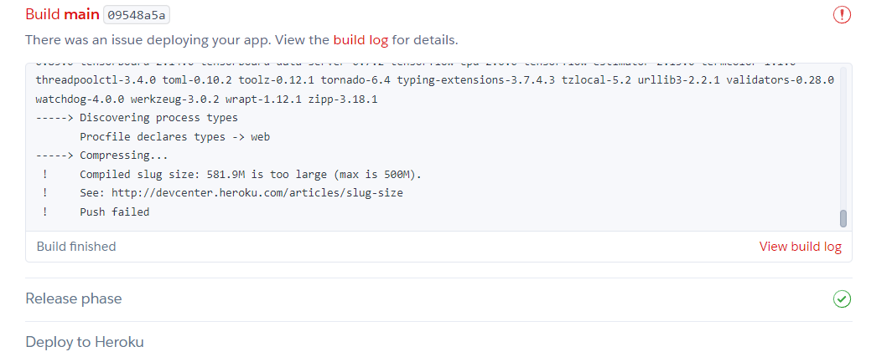
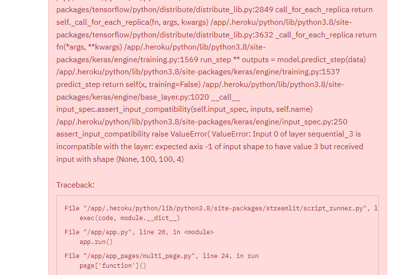

# Mildew Detector - Testing

## Testing

Testing was conducted at several stages throughout the development on both Streamlit being run from the workspace and later the deployed app on Heroku.

### Pep 8 Testing

All python files were tested for pep8 compliance. On guidance from mentor, I didn't edit code within Jupyter notebooks to pep8 standards.

## Full Manual Testing

### Project Overview Page

**Feature/Function**|**Expected Outcome**|**Method of Test**|**Result**|**Pass/Fail**
:-----:|:-----:|:-----:|:-----:|:-----:
Navigation option for Project Overview Page|Stays on Project Overview Page|Clicked Project Overview Page radio button option|Stayed on Project Overview Page|Pass
Navigation option for Leaf Visualiser Page|Redirects to Leaf Visualisation page|Clicked Leaf Visualisation radio button option|Redirected to Leaf Visualisation page|Pass
Navigation option for Mildew Detector Page|Redirects to Mildew Detector page|Clicked Mildew Detector radio button option|Redirected to Mildew Detector page|Pass
Navigation option for ML Performance Page|Redirects to ML Performance Page|Clicked ML Performance radio button option|Redirected to ML Performance page|Pass
Navigation option for Project Hypotheses Page|Redirects to Project Hypotheses page|Clicked show Project Hypotheses page button|Project Hypotheses page shown|Pass
Show Project Hypotheses and Validation Criteria Box|Shows project hypotheses and validation criteria|Clicked Show project hypotheses and validation criteria button|Project hypotheses and validation criteria shown|Pass

### Leaves Visualiser Page

**Feature/Function**|**Expected Outcome**|**Method of Test**|**Result**|**Pass/Fail**
:-----:|:-----:|:-----:|:-----:|:-----:
Navigation option for Project Overview Page|Redirects to Project Overview Page|Clicked Project Overview radio button option|Redirected to Project Overview Page|Pass
Navigation option for Leaf Visualiser Page|Remain on Leaf Visualisation page|Clicked Leaf Visualisation radio button option|Remained on Leaf Visualisation page|Pass
Navigation option for Mildew Detector Page|Redirects to Mildew Detector page|Clicked Mildew Detector radio button option|Redirected to Mildew Detector page|Pass
Navigation option for Project Hypotheses Page|Redirects to Project Hypothese page|Clicked Project Hypothese radio button option|Redirected to Project Hypothese page|Pass
Show Difference between and Average Variablility Button|Shows the saved images of the average and variability of healthy and powdery mildew leaves |Clicked the Show Difference between and Average Variablility Button|The saved images of the average and variability of healthy and powdery mildew leaves shown|Pass
Show chart for difference between healthy and powdery mildew leaves button|Shows saved images of differences between average healthy and powdery mildew leaves|Clicked show chart for differences button|Images of differences between average healthy and powdery mildew leaves shown|Pass
Show Image Montage|A selection of saved images from the data are displayed|Clicked the show image montage button|A selection of saved images from the data were displayed|Pass

### Mildew Detector Page

**Feature/Function**|**Expected Outcome**|**Method of Test**|**Result**|**Pass/Fail**
:-----:|:-----:|:-----:|:-----:|:-----:
Navigation option for Project Overview Page|Redirects to Project Overview Page|Clicked Project Overview radio button option|Redirected to Project Overview Page|Pass
Navigation option for Leaf Visualiser Page|Redirects to Leaf Visualisation page|Clicked Leaf Visualisation radio button option|Redirected to Leaf Visualisation page|Pass
Navigation option for Mildew Detector Page|Remains to Mildew Detector page|Clicked Mildew Detector radio button option|Remained to Mildew Detector page|Pass
Navigation option for Project Hypotheses Page|Redirects to Project Hypothese page|Clicked Project Hypothese radio button option|Redirected to Project Hypothese page|Pass
Upload Image Option with .png image|Prediction is made with figures and details shown|Uploaded .png image|Prediction was made with figures and details shown|Pass
Upload Image with non .png image|Error message explaining only .png formats can be accepted shown|Uploaded non .png image|Error message explaining only .png formats can be accepted shown|Pass
Healthy leaf .png prediction|Prediction of uninfected is displayed|Uploaded health leaf .png image|Prediction of uninfected was displayed|Pass
Healthy leaf .png prediction probability figure|Figure showing prediction probability in green bar graph displayed|Upload healthy leaf .png image|Figure showing prediction probability in green bar graph displayed|Pas
Powdery mildew leaf .png prediction|Prediction of infected is displayed|Upload image of leaf infected with powdery mildew in .png format|Prediction of infected is displayed|Pass
Powdery mildew prediction probability figure|Figure showing prediction probability in red bar graph displayed|Upload image of leaf infected with powdery mildew in .png format|Figure showing prediction probability in green red graph displayed|Pass
Download Prediction Report|Downloads an excel file containing the predicitons on uploaded image(s)|Clicked download report button after uploading image|Excel file downloaded which contains the predictions and details of the image files uploaded|Pass

### Project Hypotheses and Validation Page

**Feature/Function**|**Expected Outcome**|**Method of Test**|**Result**|**Pass/Fail**
:-----:|:-----:|:-----:|:-----:|:-----:
Navigation option for Project Overview Page|Redirects to Project Overview Page|Clicked Project Overview radio button option|Redirected to Project Overview Page|Pass
Navigation option for Leaf Visualiser Page|Redirects to Leaf Visualisation page|Clicked Leaf Visualisation radio button option|Redirected to Leaf Visualisation page|Pass
Navigation option for Mildew Detector Page|Redirects to Mildew Detector page|Clicked Mildew Detector radio button option|Redirected to Mildew Detector page|Pass
Navigation option for Project Hypotheses Page|Remains to Project Hypothese page|Clicked Project Hypothese radio button option|Remained to Project Hypothese page|Pass

### ML Performance Page

**Feature/Function**|**Expected Outcome**|**Method of Test**|**Result**|**Pass/Fail**
:-----:|:-----:|:-----:|:-----:|:-----:
Navigation option for Project Overview Page|Redirects to Project Overview Page|Clicked Project Overview radio button option|Redirected to Project Overview Page|Pass
Navigation option for Leaf Visualiser Page|Redirects to Leaf Visualisation page|Clicked Leaf Visualisation radio button option|Redirected to Leaf Visualisation page|Pass
Navigation option for Mildew Detector Page|Redirects to Mildew Detector page|Clicked Mildew Detector radio button option|Redirected to Mildew Detector page|Pass
Navigation option for Project Hypotheses Page|Redirects to Project Hypothese page|Clicked Project Hypothese radio button option|Remained to Project Hypothese page|Pass
Checkbox to display green pixel analysis|Displays figures and text for green pixel analysis|Clicked display green pixel analysis checkbox|Figures and text for green pixel analysis displayed|Pass

## Bugs

### Resolved Bugs

An ongoing issue throughout the development of this project was ensuring correct compatibility of the various libraries being used in conjunction with each other. 

Whilst the combination of versions captured in the requirements.txt now allow all necessary functions and actions to be carried out, it took considerable time to find the right combination. 

1. Set page config can only be called once - One issue arose relatively early in the development of this project, which was an error message stating that the streamlit config - st.set_page_config - could only be called once. As I only had this being called once in the project I was unsure how or why this error was being raised. After some investigation I discovered that removing test st.write code, that I used when first creating the code for each dashboard page, but before I had written the full function for each page, was the culprit. For example, if I had say st.write("This is page 3") after the import statements but before the actual code defining the function of page3_create(): , then this would raise the error. Having this code outside of the page_create functions, must trigger the set_page_config  twice for each page, when the initilisation function in MultiPage is called, when app.py is run. Ensuring all the page code was within the specific page create functions removed the error.

2. Slug size too large - This was an issue when first attempting to deploy to Heroku with the first version of the mahcine learning model. Despite a number of attempts to reduce the slug and add as much as possible to the .slugignore, eventually an alternative model trained on resized 100 pixel images was necessary to come under the 500MB max slug size. This model was however trained far more rapidly than the first version on 256 pixel images.

3. Issue with Image Axis - As displayed in the screenshot below, I hit an issue with the Mildew predictor, which very oddly only raised the issue when uploading images of leaves with powdery mildew. Healthy leaves could be processed and the prediction made without any problem. This was the case with images taken from the dataset, or completely random leaf images taken from the internet. After a great deal of investigation I found that in some cases the image type was being converted to RGBA and this was altering the image shape, rather than the expected RGB. This meant when uploading powdery mildew images, the below error was thrown, which seems to relate to the 4th shape value, rather than 3 which the program is expecting. Why this happens solely and consistently for powdery mildew images and not others is still a mystery, my best guess is that the presence of white pixels in the image is somehow changing the image shape, but I am not sure how this is happening. My solution to this was simply to add to the relevant function to convert RGBA images to RGB if that image type is detected. 

4. git error remote: No anonymous write access. fatal: Authentication failed - This error appeared in the later stages of the project when trying to push changes to github. I did not identify the precise cause for the error but it seemed that at some points my commits were interrupted which caused an overlap and inconsistency between the workspace and repo. To resolve this I created a personal access token on github and incorporated this into the workspace. Following the commands this prompted resolved the issue and allowed the queued commits to go through to the repo. This is why there is a series of 'Test commit after github issues' commit messages towards the end of the project, these are several commits being sent through after finally getting the solution in place. 